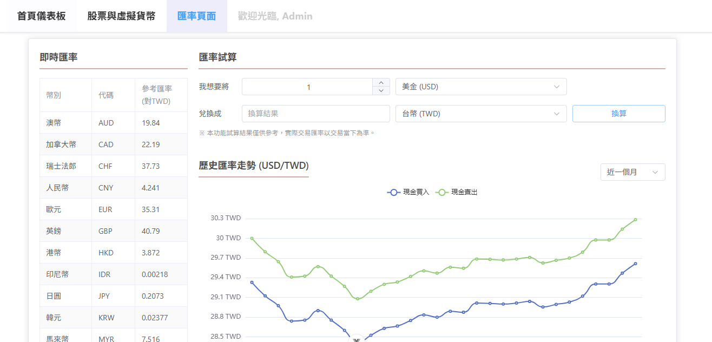

# 財經投資儀表板 (Financial Dashboard)

這是一個個人化的財經投資儀表板 Side Project，旨在整合即時的匯率、股價及個人化投資組合資訊，打造一個多功能、高效率的資產追蹤工具。

專案的起點「匯率查詢模組」是對我過往一個舊版工具的重構與升級，全面採用 **Vue 3 (Composition API)**  進行開發，藉此深化對現代前端框架的掌握，並建立一個更穩健、更易於擴充的專案架構。

---

## 專案狀態 (Project Status)

🚧 **持續開發中 (Under Active Development)**

目前已完成「匯率查詢模組」的核心功能開發，並已上線。其他如「股票追蹤」與「儀表板總覽」等模組，正在積極規劃與開發中。

---

## 功能規劃 (Features)

### ✅ 匯率查詢模組 (已完成)

此模組提供全面的匯率查詢與分析功能，特色如下：

*   **即時匯率**：透過 Vite Proxy 代理，即時抓取並解析台灣銀行的牌告匯率，提供最準確的參考數據。
*   **歷史走勢圖**：整合 ECharts 資料視覺化套件，提供「近一個月」、「近三個月」、「近半年」及「指定月份」的歷史匯率走勢圖（包含現金買入與賣出價）。
*   **匯率試算機**：方便使用者快速換算不同幣別的金額。
*   **技術亮點**：
    *   前端直接解析台灣銀行提供的 `.csv` 格式資料，展現資料處理能力。
    *   透過 Vite Proxy 解決前端開發中最常見的 CORS 跨域請求問題。

### ⏳ 股票追蹤模組 (規劃中)

將串接第三方財經 API (如 Financial Modeling Prep)，提供美股與台股的追蹤功能。

*   即時股價與漲跌幅顯示。
*   個股歷史 K 線圖。
*   個股關鍵資訊（成交量、市值等）。
*   自訂股票清單。

### 📊 儀表板總覽 (規劃中)

將匯集所有模組的數據，以視覺化圖表呈現個人總資產的概覽。

*   投資組合總市值與損益分析。
*   資產配置圓餅圖（股票、虛擬貨幣、現金比例）。
*   總資產歷史趨勢折線圖。

---

## 技術棧 (Tech Stack)

*   **前端框架**: Vue 3 (Composition API) + TypeScript
*   **開發與建置工具**: Vite
*   **UI 元件庫**: Element Plus
*   **資料視覺化**: ECharts
*   **HTTP 客戶端**: Axios
*   **開發伺服器代理**: Vite Proxy (用於解決 CORS 問題)
*   **版本控制**: Git

